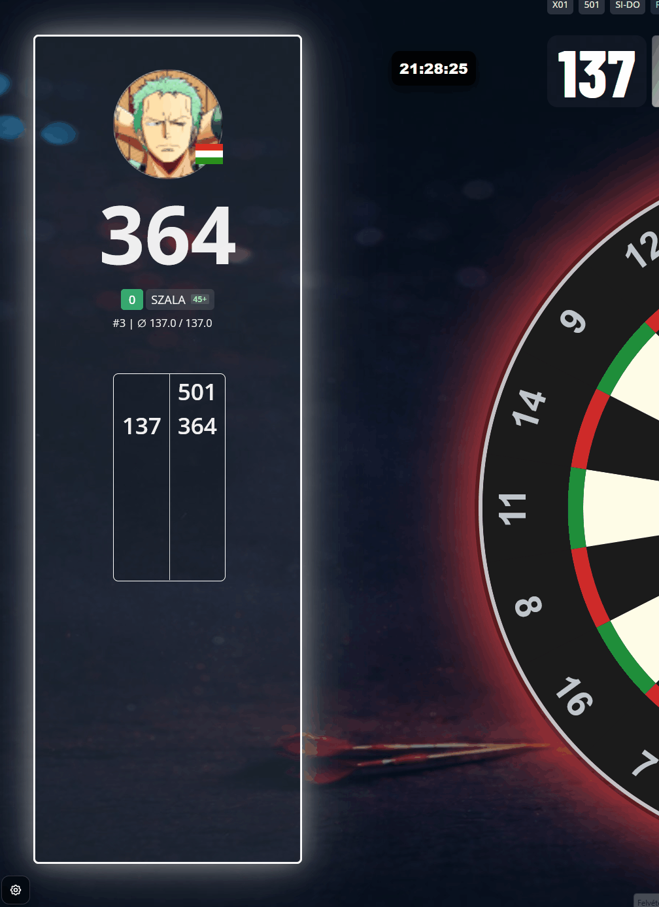
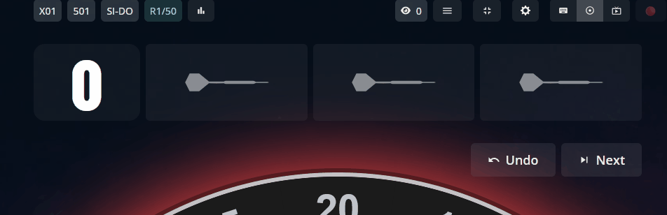
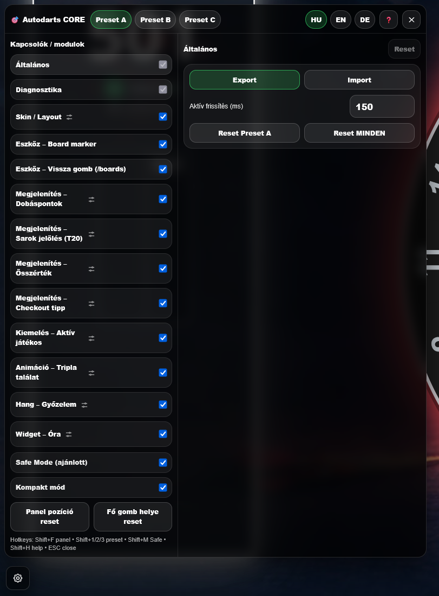
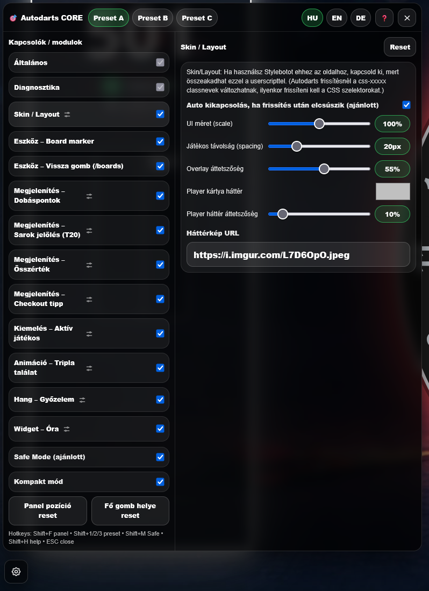
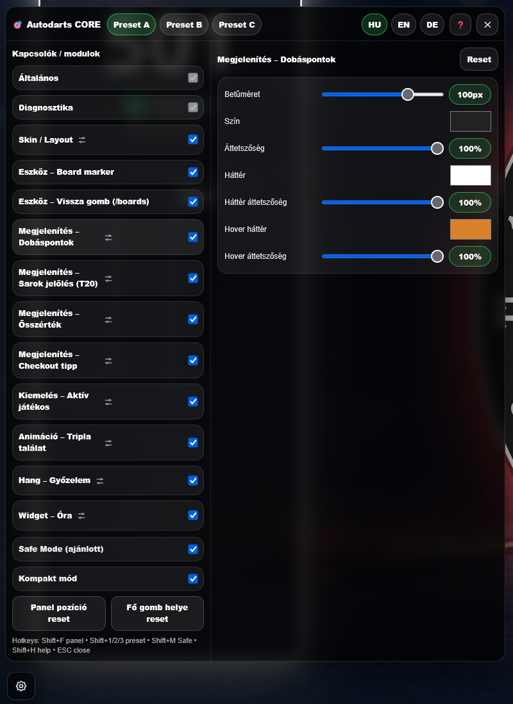
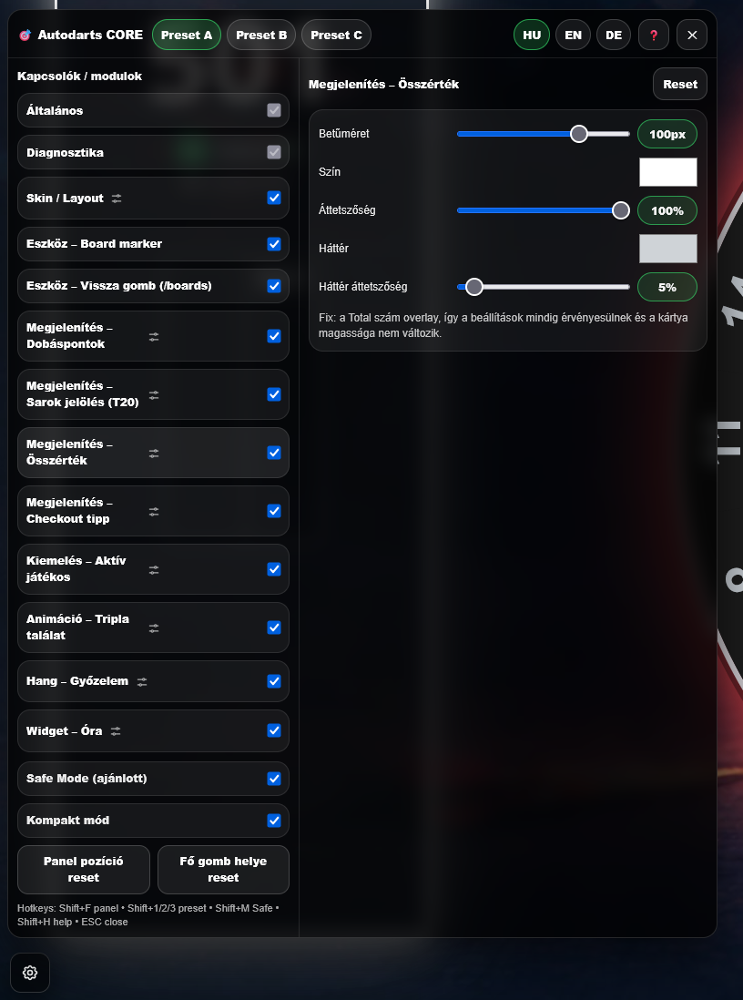
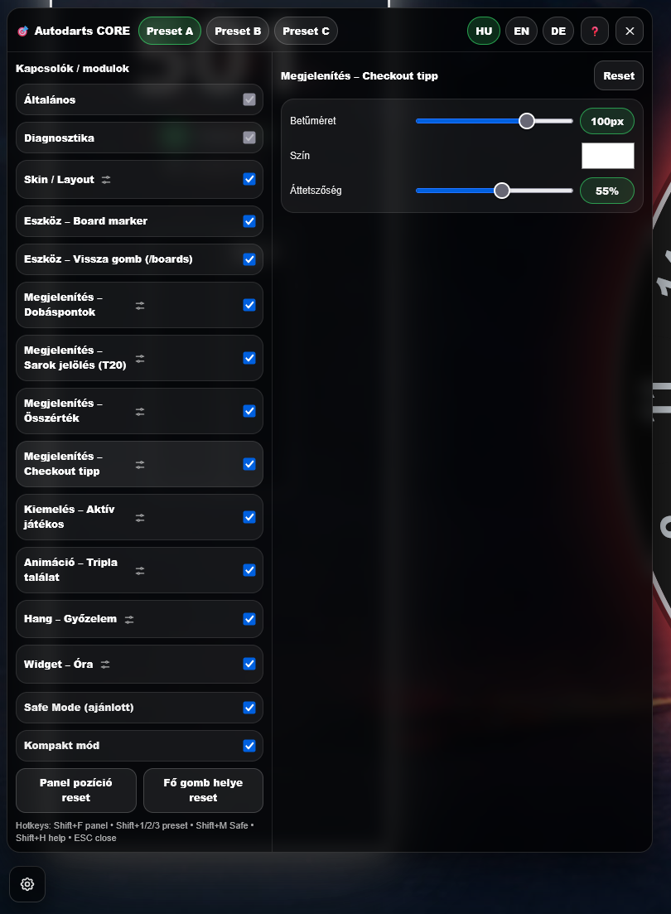
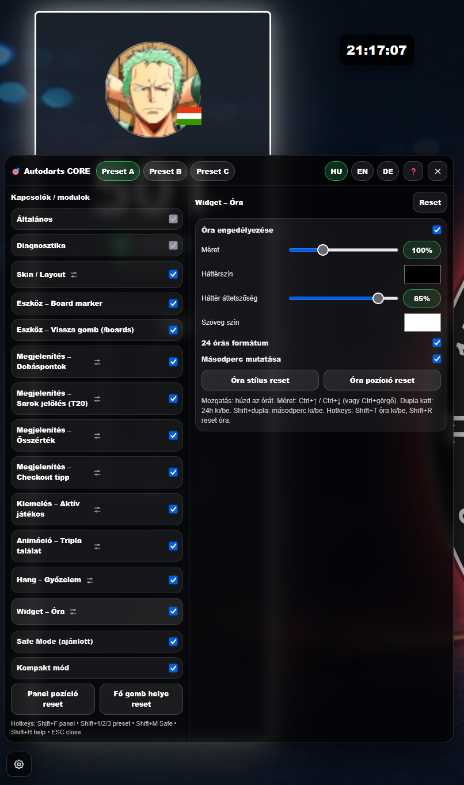

<!-- README.hu.md (Magyar) -->

# Autodarts – CORE (Userscript)

**Nyelvek:** [English](README.md) · [Magyar](README.hu.md) · [Deutsch](README.de.md)

Moduláris userscript **play.autodarts.io**-hoz, ami egy állítható **CORE panelt** ad presetekkel és sok UI extrával.

> ⚠️ Jogi/egyéb: Ez egy közösségi fejlesztés, **nem hivatalos Autodarts kiegészítő**.

## Funkciók
- Preset **A/B/C**
- **HU / EN / DE** nyelv
- **Safe Mode**
- Kapcsolható **Skin / Layout** (integrált CSS)
- Dobásérték → pontérték (**T20 → 60**, **D2 → 4**, stb.)
- **Total overlay** javítás
- Checkout tipp kiemelés
- Aktív játékos kiemelése
- Tripla találat animáció
- Opcionális győzelmi zene
- Lebegő óra widget
- Board marker eszköz
- Opcionális **“Vissza az Autodartsba”** gomb a `/boards` oldalon

---

## Előnézet

### GIF-ek

 

### Képernyőképek

---

## Támogatott oldalak
- Meccs UI: `https://play.autodarts.io/matches/...`
- Boards oldal (opcionális vissza gomb): `https://play.autodarts.io/boards`

---

## Gyorsbillentyűk
- **Shift+F** — panel ki/be
- **Shift+1 / Shift+2 / Shift+3** — Preset A / B / C
- **Shift+M** — Safe Mode ki/be
- **Shift+H** — Súgó ki/be
- **Shift+T** — Óra ki/be
- **Shift+R** — Óra reset
- **ESC** — bezár

---

## Telepítés

### Violentmonkey (Firefox)
1. Telepítsd a **Violentmonkey** kiegészítőt
2. Nyisd meg a RAW script linket:
   `https://raw.githubusercontent.com/Szala86/Autodarts-core/main/autodarts-core.user.js`
3. Kattints az **Install** gombra

### Tampermonkey (Chrome)
1. Telepítsd a **Tampermonkey** kiegészítőt
2. Nyisd meg a RAW script linket:
   `https://raw.githubusercontent.com/Szala86/Autodarts-core/main/autodarts-core.user.js`
3. **Install**

---

## Frissítés
A userscript managerben:
- “Check for updates” (vagy automata frissítés)

---

## Használati tippek
- A Preset A/B/C külön beállítást tárol.
- A Safe Mode korlátozza a túl nagy értékeket, hogy stabil maradjon a UI.
- Ha használsz **Stylebotot** play.autodarts.io-hoz, kapcsold ki, mert összeakadhat a beépített Skin/Layout modullal.

---

## Köszönet / Forrásmegjelölés
- **Back-to-AD-Button** funkció: **MartinHH** scriptje alapján
- **Animate Triple Autodarts** / tripla animáció koncepció: **amazingjin** fejlesztő scriptje alapján

---

## Hibakeresés
Autodarts frissítés után a Chakra `.css-xxxxx` classnevek változhatnak.
Lehetőleg ezeket használd:
- `#ad-ext-turn`
- `#ad-ext-player-display`
- saját custom classok

---

## Licenc
Ajánlott egy `LICENSE` fájl hozzáadása.
